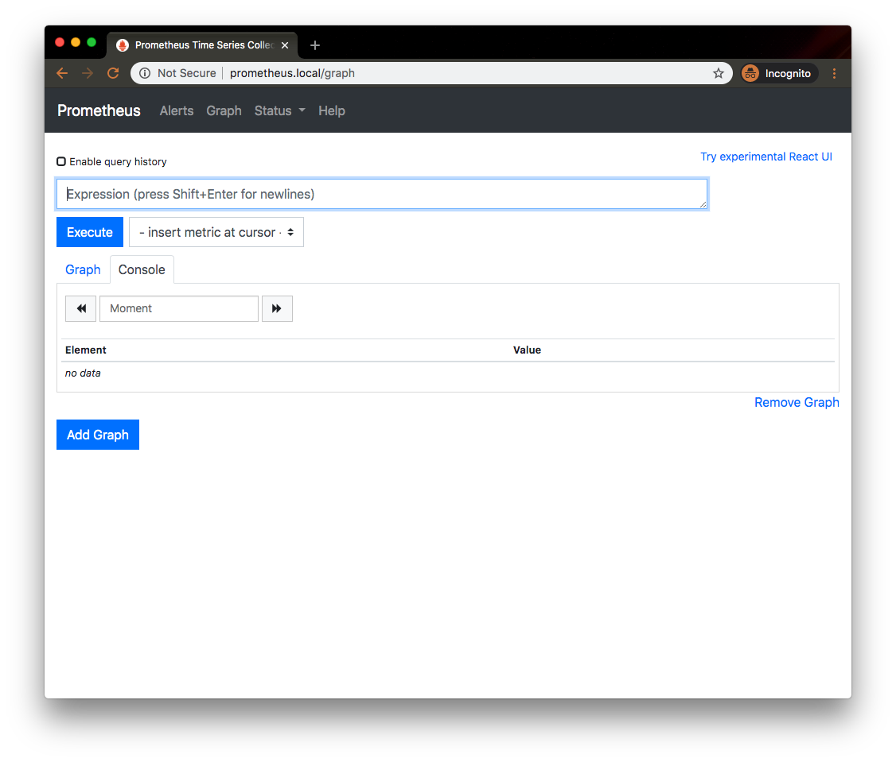
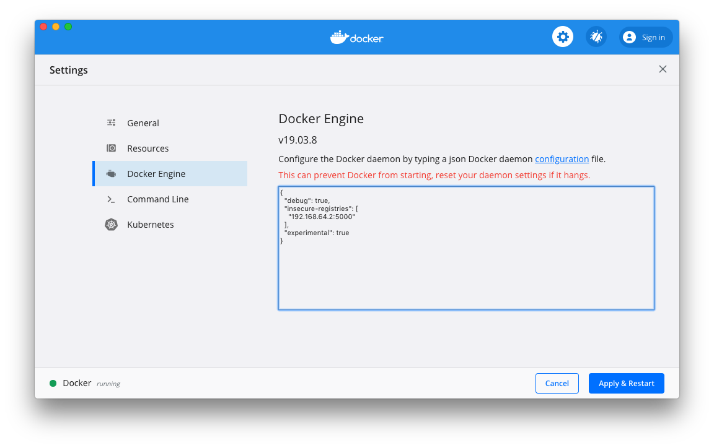

# Prometheus Client Examples
> A small collection of examples to demonstrate how to instrument applications with prometheus metrics

Prerequisites
------
* minikube: tested with `v1.8.2`
* docker: tested with `version 19.03.5`


Running
------
Run a local prometheus monitoring stack on minikube

1. start a fresh version of minikube
    ```
    $ minikube delete && minikube start --kubernetes-version=v1.17.3 --memory=6g --bootstrapper=kubeadm --extra-config=kubelet.authentication-token-webhook=true --extra-config=kubelet.authorization-mode=Webhook --extra-config=scheduler.address=0.0.0.0 --extra-config=controller-manager.address=0.0.0.0
    ```

    The kube-prometheus stack includes a resource metrics API server, so the metrics-server addon is not necessary. Ensure the metrics-server addon is disabled on minikube:

   ```
   $ minikube addons disable metrics-server
   $ minikube addons enable ingress
   $ minikube addons enable registry
   ```


1. Create the monitoring stack using the config in the manifests directory.  Create the namespace and CRDs, and then wait for them to be availble before creating the remaining resources

    ```
    $ kubectl create -f kube-prometheus/manifests/setup
    $ until kubectl get servicemonitors --all-namespaces ; do date; sleep 1; echo ""; done
    $ kubectl create -f kube-prometheus/manifests/
    $ kubectl create -f client_manifests/
    ```

1. Build and push all docker images for prometheus client examples `make all`

1. Add the IP of the minikube ingress into `/etc/hosts`, along with local DNS names. In this example the minikube ingress IP is `192.168.64.2`.

   ```
   $ minikube ip
   192.168.64.2
   ```

    _/etc/hosts_
    ```
    192.168.64.2 alertmanager.internal grafana.internal prometheus.internal ruby-client.internal golang-client.internal python-client.internal
    ```

1. Review your infrastructure in the browser. Note the default login for grafana is `admin/admin`

    ```
    $ open http://grafana.internal http://alertmanager.internal http://prometheus.internal
    ```

    

1. Configure the minikube registry as an [insecure docker registry][6], by adding the minikube registry `IP:PORT` to `daemon.json`.  If you use Docker Desktop for Mac or Docker Desktop for Windows, click the Docker icon, choose **Preferences**, and choose **Docker Engine**.

    

    #### At this point kubernetes is configured with full monitoring stack. We can now deploy our instrumented applications to the cluster.

1. Apply the `Deployment`, `Service`, `ServiceMonitor`, and `Ingress` for our prometheus clients

    ```
    $ kubectl apply -f client-manifests/
    ```

1. Navigate to all client `/metrics` endpoints

    ```
    $ open http://ruby-client.internal/metrics http://golang-client.internal/metrics http://python-client.internal/metrics
    ```
## Teardown

```
$ kubectl delete --ignore-not-found=true -f kube-prometheus/manifests/ -f kube-prometheus/manifests/setup -f client_manifests/
$ minikube delete
```

## Troubleshooting

Occsionally the kube-apiserver gets in a bad state in minikube, with the following error.

```
error: unable to upgrade connection: Authorization error (user=kube-apiserver-kubelet-client, verb=create, resource=nodes, subresource=proxy)
```

Restarting minikube may help return the apiserver to a working state

```
$ minikube stop
$ minikube start
```

## References
* [client_golang][1]
* [client_python][2]
* [client_ruby][3]
* [kube-prometheus][5]


[1]: https://github.com/prometheus/client_golang
[2]: https://github.com/prometheus/client_python
[3]: https://github.com/prometheus/client_ruby
[4]: https://github.com/coreos/prometheus-operator
[5]: https://github.com/coreos/kube-prometheus
[6]: https://docs.docker.com/registry/insecure/